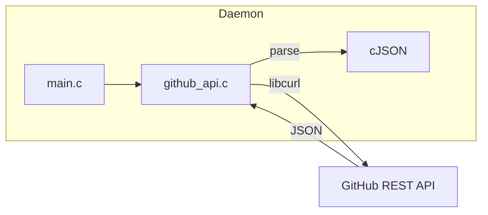

# Реализация github_get_pull_requests()

## Текущее состояние

- [main.c](daemon/main.c) уже ожидает модуль `github/github_api.h`
- [Makefile](daemon/Makefile) настроен на компиляцию `github_api.c` с `-lcurl`
- Директория `daemon/github/` пуста — нужно создать базовую инфраструктуру

## Архитектура



## Файлы для создания

### 1. [daemon/github/github_api.h](daemon/github/github_api.h)

Структуры данных:

```c
typedef struct {
    char* name;
    char* full_name;
    char* owner;
    char* description;
    char* default_branch;
    int stars;
    int forks;
    bool is_private;
} GitHubRepository;

typedef struct {
    int id;
    int number;
    char* title;
    char* body;
    char* state;        // "open" или "closed"
    char* user_login;
    char* head_ref;     // ветка источник
    char* base_ref;     // целевая ветка
    char* html_url;
    char* created_at;
    char* updated_at;
    bool draft;
} GitHubPullRequest;

typedef struct {
    GitHubPullRequest* items;
    int count;
} GitHubPullRequestList;
```

API функции:

```c
int github_api_init(void);
void github_api_cleanup(void);

GitHubRepository* github_get_repository(const char* owner, const char* repo, const char* token);
void github_repository_free(GitHubRepository* repo);

GitHubPullRequestList* github_get_pull_requests(const char* owner, const char* repo, const char* token, const char* state);
void github_pull_request_list_free(GitHubPullRequestList* list);
```

### 2. [daemon/github/github_api.c](daemon/github/github_api.c)

Реализация:

- `github_api_init()` / `github_api_cleanup()` — инициализация/очистка libcurl
- `github_api_get()` — HTTP GET запрос с авторизацией Bearer token
- `github_get_repository()` — GET `/repos/{owner}/{repo}`
- `github_get_pull_requests()` — GET `/repos/{owner}/{repo}/pulls?state={state}`
- Парсинг JSON ответов с помощью cJSON

## GitHub API Endpoint

```
GET https://api.github.com/repos/{owner}/{repo}/pulls?state=open
Authorization: Bearer {token}
Accept: application/vnd.github+json
```

Параметр `state`: `open`, `closed`, `all`