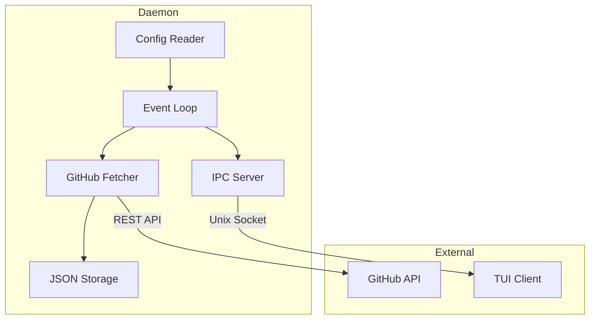

# Следующие шаги для GitFlow Dashboard

## Текущий статус

**Готово:**

- `config/` — загрузка конфигурации из JSON
- `github/` — базовый API (получение информации о репозитории)
- `main.c` — точка входа, тестирование

**Пустые директории:**

- `core/`, `storage/`, `ipc/`, `http/`, `metrics/`, `logging/`

---

## Phase 1 MVP — что нужно реализовать

Согласно [arc.md](arc.md), для MVP нужно:

```
daemon: fetcher + aggregator + storage(JSON) + IPC(SUBSCRIBE/GET_STATE)
tui: базовая панель, список PR/Issues, live события
```

---

## Рекомендуемый порядок реализации

### 1. Расширить GitHub API (fetcher)

Добавить в [daemon/github/github_api.h](daemon/github/github_api.h):

- `github_get_pull_requests()` — получение списка PR
- `github_get_issues()` — получение списка Issues
- `github_get_commits()` — получение коммитов
- Rate limiting и ETag кэширование

### 2. Storage (JSON снапшоты)

Создать в `daemon/storage/`:

- `storage.h/c` — сохранение/загрузка состояния в `state.json`
- Периодическое сохранение данных
- Восстановление при старте daemon

### 3. Logging

Создать в `daemon/logging/`:

- `logger.h/c` — уровни логов (DEBUG, INFO, WARN, ERROR)
- Вывод в файл и/или syslog

### 4. IPC (Unix Socket)

Создать в `daemon/ipc/`:

- `ipc_server.h/c` — сервер Unix socket
- Протокол: `GET_STATE`, `SUBSCRIBE`, `PING/PONG`
- Framed JSON (длина + JSON)

### 5. Core (Event Loop)

Создать в `daemon/core/`:

- `event_loop.h/c` — основной цикл daemon
- Таймеры для периодического опроса GitHub
- Обработка IPC запросов

---

## Диаграмма архитектуры MVP



---

## С чего начать?

Рекомендую начать с **GitHub API для PR/Issues**, так как это основа данных для всего приложения.